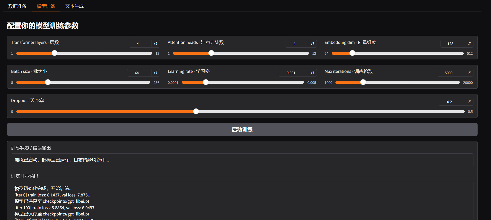

# FromScratch-Chinese-GPT

> 从零手搓的一个轻量级中文 GPT 框架，内置可视化调参界面，一站式训练与生成！

## 项目演示（demo）

[点击观看（B站链接）](https://www.bilibili.com/video/BV1a3dpYFE3P/?spm_id_from=333.1387.upload.video_card.click&vd_source=2f1cd124dba46f7de06932bead1d0d49)  

## 演示示例图

## 当前版本列表

✅ v1.0 : 基于字符级 GPT，支持 Gradio 页面操作进行可视化调参，一站式训练与生成。

## 项目特色

- 手搓字符级 GPT：不依赖 Hugging Face，纯 PyTorch 实现
- 可视化训练：Gradio 页面自由调参，一键训练，快速生成
- 使用方便：适合 NLP 初学者 / 创意研究者 / 中文应用者

## 使用方法

请进入对应版本文件夹查看说明：
- [v1.0 使用说明](v1.0/README.md)

## 许可证

本项目使用 MIT 协议，欢迎自由使用、修改与发布。

## 鸣谢

本项目的开发灵感主要来源于：

- [nanoGPT](https://github.com/karpathy/nanoGPT) by [Andrej Karpathy](https://github.com/karpathy)

感谢 Karpathy 开源的 nanoGPT 项目及其极具启发性的教学内容，为本项目提供了重要参考。

## 作者

由 [@luer](https://github.com/Luer211) 开发与维护。  
欢迎关注与交流，如有建议或合作意向，欢迎提交 Issue 或 PR！
